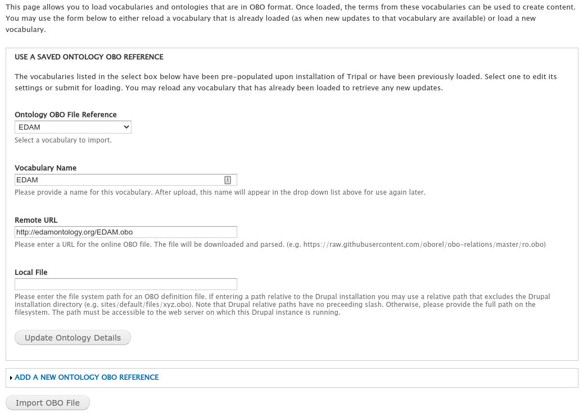
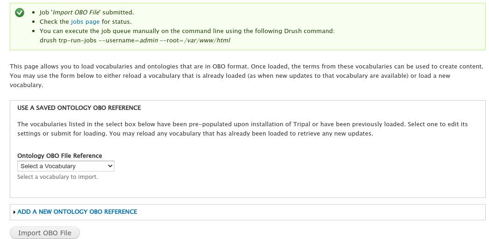

Installation
============

Module Installation
-------------------

The Tripal File module is available as a full Drupal module.  Therefore, it can be installed following the typical Drupal module installation either via the GUI or via Drush.  We'll do so here using a Drush command:

.. code-block:: bash

  drush pm-enable tripal_file

You will be asked if you would like to download and then enable the module.  

Install the EDAM Vocabulary
---------------------------
The `EDAM vocabulary <http://edamontology.org/page>`_ is needed for the File module because it provides many of the file types (e.g. FASTA, GFF3, VCF, etc). Any file that is managed by the Tripal File module requires a file type.  

The EDAM vocabulary details are automatically added by the Tripal File module, but you will need to install the vocaulary.  To do this navigate to the ``Administration > Tripal > Data Loaders > Chado Vocabularies >> OBO Vocabulary Loader`` page via the administrative menu.  Select the 'EDAM' vocabulary from the "Ontology OBO File Reference" drop down and click the "Import OBO File".

Depending how you have your Tripal site setup to run jobs you can either wait for the job to complete or manually run it using the command provided in the green box at the top of the page:

Set Permissions
---------------
Now that the Tripal File module is installed, we must set permissions so that users can view and or create File and Licesne content types.  To set permissions, navigate to **People** page and click the **Permissions** tab in the top right. Look for permissions that gbegin with prefix `File:` and `License:` and set the according to your needs. 

.. image:: ./install_permissions.png

.. warning::

  If your site is not new you may have additional roles.  As a rule you should not give the anonymous anytthing other than 'view' permission.

