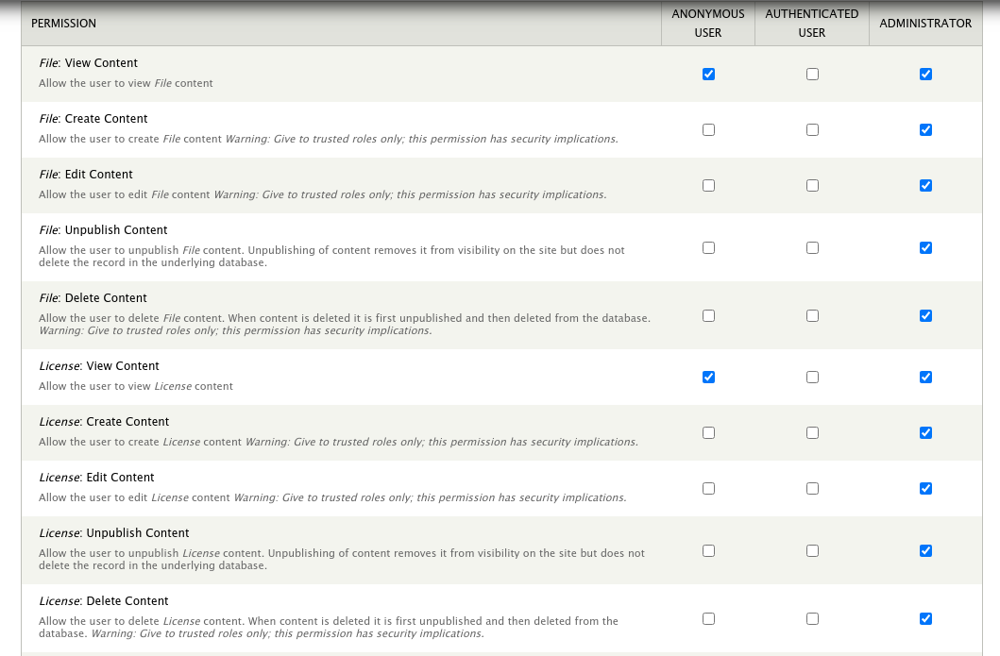

Installation
============

Step 1: Module Installation
---------------------------

The Tripal File module is available as a full Drupal module.  Therefore, it can be installed following the typical Drupal module installation either via the GUI or via Drush.  We'll do so here using a Drush command:

.. code-block:: bash

  drush pm-enable tripal_file

If you do not have the module already downloaded and available in the `sites/all/modules` folder of your Drupal site, then you will be asked if you would like to download and then enable the module.

The module will create two new content types: `File` and `License`. It will also create a variety of tables in your Chado database for associating files to base records. Upon installation you should see the following:

.. code-block:: bash

    $ drush pm-enable tripal_file

    The following extensions will be enabled: tripal_file
    Do you really want to continue? (y/n): y
    INFO (TRIPAL_ENTITIES): Done.
    INFO (TRIPAL_ENTITIES): Done.
    tripal_file was enabled successfully.                                        [ok]
    Custom table, 'file' ,  created successfully.                                [status]
    Custom table, 'license' ,  created successfully.                             [status]
    Custom table, 'file_contact' ,  created successfully.                        [status]
    Custom table, 'fileloc' ,  created successfully.                             [status]
    Custom table, 'fileprop' ,  created successfully.                            [status]
    Custom table, 'fileloc' , already exists. Table structure not changed, but   [status]
    definition array has been saved.
    Custom table, 'file_license' ,  created successfully.                        [status]
    Custom table, 'analysis_file' ,  created successfully.                       [status]
    Custom table, 'assay_file' ,  created successfully.                          [status]
    Custom table, 'biomaterial_file' ,  created successfully.                    [status]
    Custom table, 'cv_file' ,  created successfully.                             [status]
    Custom table, 'eimage_file' ,  created successfully.                         [status]
    Custom table, 'feature_file' ,  created successfully.                        [status]
    Custom table, 'featuremap_file' ,  created successfully.                     [status]
    Custom table, 'library_file' ,  created successfully.                        [status]
    Custom table, 'nd_protocol_file' ,  created successfully.                    [status]
    Custom table, 'organism_file' ,  created successfully.                       [status]
    Custom table, 'phylotree_file' ,  created successfully.                      [status]
    Custom table, 'project_file' ,  created successfully.                        [status]
    Custom table, 'pub_file' ,  created successfully.                            [status]
    Custom table, 'stock_file' ,  created successfully.                          [status]
    Custom table, 'stockcollection_file' ,  created successfully.                [status]
    Custom table, 'study_file' ,  created successfully.                          [status]
    NOTICE: Added the EDAM ontology. Please navigate to Tripal >> Data Loaders >>[status]
    Chado Vocabularies >> OBO Vocabulary Loader and submit a job to import the
    EDAM vocabulary.

Step 2: Install the EDAM Vocabulary
-----------------------------------
The `EDAM vocabulary <http://edamontology.org/page>`_ is needed for the File module because it provides many of the file types (e.g. FASTA, GFF3, VCF, etc). Any file that is managed by the Tripal File module requires a file type.

The EDAM vocabulary details are automatically added by the Tripal File module, but you will need to install the vocaulary.  To do this navigate to the **Administration** > **Tripal** > **Data Loaders** > **Chado Vocabularies** > **OBO Vocabulary Loader** page via the administrative menu.  Select the **EDAM** vocabulary from the **Ontology OBO File Reference** drop down and click the **Import OBO File**.

Step 3: Set Permissions
-----------------------
Now that the Tripal File module is installed, we must set permissions so that users can view and or create File and License content types.  To set permissions, navigate to **People** page and click the **Permissions** tab in the top right. Look for permissions that begin with prefix `File:` and `License:` and set the according to your needs.

.. warning::

  You should not give the anonymous user any permissions other than 'view' permission.
