Usage
=====

Adding a License
----------------
To ensure data files offered by your Tripal site meet `FAIR data principles <https://www.go-fair.org/fair-principles/>`_, all files must be associated with a license.  Therefore, before adding files, you must first create new **License** content types.  You can create as many **License** files as needed for the data on your site.

To create a new license page, navigate to **Admin** > **Add Tripal Content Types** and scroll to the bottom of the page where the **Other** category is found.  There you will see the **License** content type.  Click the link to create a new license page.

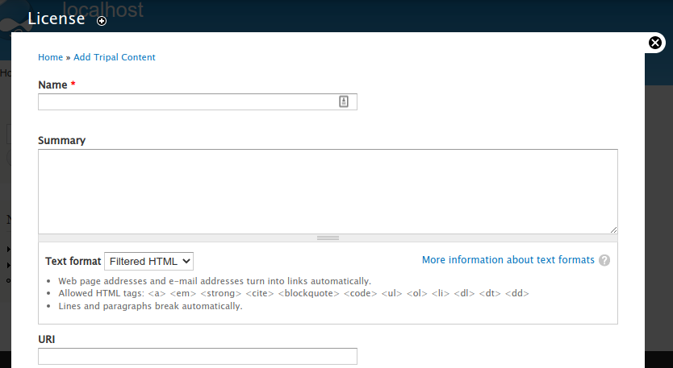

To create your license page you can:

1. Option 1: Fully define the license by giving it a name and provide the full description
2. Option 2: Summarize the license by giving a name, providing a brief summary (or no summary) and providing the URL to the full license online.

.. note::

    It is best practice to provide a human readable summary of the user's rights in the Summary field and to provide a link to the full legal text of the license via the URI field.

Example Licenses
````````````````
A few example licenses are provided below along with the values that may be appropriate for the **License** page fields.

Public Domain Data
~~~~~~~~~~~~~~~~~~
Data that is public, where no on retains rights to it. Therefore, it needs a license page even though "public domain" is not an actual license. You can use the following values when creating a public domain license page:

+---------+-------------------------------------------------------------------+
| Field   | Value                                                             |
+=========+===================================================================+
| Name    | Public Domain                                                     |
+---------+-------------------------------------------------------------------+
| Summary | The data has no known copyrights or restrictions and              |
|         | can be be freely used by anyone.                                  |
+---------+-------------------------------------------------------------------+

CC0 1.0 Universal (CC0 1.0)
~~~~~~~~~~~~~~~~~~~~~~~~~~~
The text for the summary below came from https://creativecommons.org/publicdomain/zero/1.0/.

+---------+-------------------------------------------------------------------+
| Field   | Value                                                             |
+=========+===================================================================+
| Name    | CC0 1.0 Universal (CC0 1.0)                                       |
+---------+-------------------------------------------------------------------+
| Summary | The person who associated a work with this deed has dedicated the |
|         | work to the public domain by waiving all of his or her rights to  |
|         | the work worldwide under copyright law, including all related and |
|         | neighboring rights, to the extent allowed by law. You can copy,   |
|         | modify, distribute and perform the work, even for                 |
|         | commercial purposes, all without asking permission.               |
|         |                                                                   |
|         | - In no way are the patent or trademark rights of any person      |
|         |   affected by CC0, nor are the rights that other persons may have |
|         |   in the work or in how the work is used, such as publicity or    |
|         |   privacy rights.                                                 |
|         | - Unless expressly stated otherwise, the person who associated a  |
|         |   work with this deed makes no warranties about the work, and     |
|         |   disclaims liability for all uses of the work, to the fullest    |
|         |   extent permitted by applicable law.                             |
|         | - When using or citing the work, you should not imply endorsement |
|         |   by the author or the affirmer.                                  |
+---------+-------------------------------------------------------------------+
| URI     | https://creativecommons.org/publicdomain/zero/1.0/legalcode       |
+---------+-------------------------------------------------------------------+

Attribution 4.0 International (CC BY 4.0)
~~~~~~~~~~~~~~~~~~~~~~~~~~~~~~~~~~~~~~~~~
The text for the summary below came from https://creativecommons.org/licenses/by/4.0/.

+---------+-------------------------------------------------------------------+
| Field   | Value                                                             |
+=========+===================================================================+
| Name    | Attribution 4.0 International (CC BY 4.0)                         |
+---------+-------------------------------------------------------------------+
| Summary | You are free to:                                                  |
|         |                                                                   |
|         | - **Share**: copy and redistribute the material in any medium     |
|         |   or format                                                       |
|         | - **Adapt**: remix, transform and build upon the material for any |
|         |   purpose, even commercially.                                     |
|         |                                                                   |
|         | The licensor cannot revoke these freedoms as long as you follow   |
|         | the following license terms:                                      |
|         |                                                                   |
|         | - **Attribution** You must give appropriate credit, provide a     |
|         |   link to the license, and indicate if changes were made. You may |
|         |   do so in any reasonable manner, but not in any way that         |
|         |   suggests the licensor endorses you or your use.                 |
|         | - **No additional restrictions** You may not apply legal terms or |
|         |   technological measures that legally restrict others from doing  |
|         |   anything the license permits                                    |
|         |                                                                   |
|         | **Notices:**                                                      |
|         |                                                                   |
|         | - You do not have to comply with the license for elements of the  |
|         |   material in the public domain or where your use is permitted by |
|         |   an applicable exception or limitation.                          |
|         | - No warranties are given. The license may not give you all of    |
|         |   the permissions necessary for your intended use. For example,   |
|         |   other rights such as publicity, privacy, or moral rights may    |
|         |   limit how you use the material.                                 |
+---------+-------------------------------------------------------------------+
| URI     | https://creativecommons.org/licenses/by/4.0/legalcode             |
+---------+-------------------------------------------------------------------+

Adding a File
-------------
To demonstrate adding a file, we will provide an example using the genome files that are provided in the `Tripal User's Guide <https://tripal.readthedocs.io/en/latest/index.html>`_ in the section titled `Setup of an Example Site <https://tripal.readthedocs.io/en/latest/user_guide/example_genomics.html>`_. Those instructions direct the reader to create an **Analysis** page to represent the whole genome assembly of the *Citrus sinensis* v1.0 genome. We will associate the files to that analysis.  If you have followed along with the Tripal User's Guide you will already have those files uploaded.

If you have not followed the Tripal User's Guide but would like to follow along here, you must follow `these instructions to create an Analysis page <https://tripal.readthedocs.io/en/latest/user_guide/example_genomics/analyses.html>`_. And obtain the files here:

- `Citrus sinensis-orange1.1g015632m.g.gff3 <http://tripal.info/sites/default/files/Citrus_sinensis-orange1.1g015632m.g.gff3>`_
- `Citrus sinensis-scaffold00001.fasta <http://tripal.info/sites/default/files/Citrus_sinensis-scaffold00001.fasta>`_
- `Citrus sinensis-orange1.1g015632m.g.fasta <http://tripal.info/sites/default/files/Citrus_sinensis-orange1.1g015632m.g.fasta>`_

To create a new file page, navigate to **Admin** > **Add Tripal Content Types** and scroll to the bottom of the page where the **Other** category is found.  There you will see the **File** content type.  Click the link to create a new file page. The following page appears.

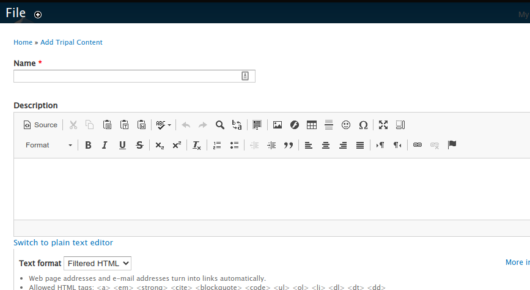

On this page you can:

1. Provide a **name** (required) and **description** for the file.
2. Indicate a file **type** (required).
3. Indicate the file **source** (or contact person) who was rights to the data.
4. Indicate the file **location** (either locally or via remote URL).
5. And set the **license** (required).

First, we will create the whole genome FASTA file page.  Enter the following in the File page fields:

+--------------+--------------------------------------------------------------+
| Field        | Value                                                        |
+==============+==============================================================+
| Name         | *Citrus sinesis* Whole Genome Assembly v1.0                  |
+--------------+--------------------------------------------------------------+
| Description  | The whole genome assembly, v1.0, of *Citrus sinensis*.       |
+--------------+--------------------------------------------------------------+
| Type         | FASTA                                                        |
+--------------+--------------------------------------------------------------+
| File Source  | *Leave blank or provide any contact you may have already*    |
+--------------+--------------------------------------------------------------+
| Location     | Citrus sinensis-scaffold00001.fasta                          |
+--------------+--------------------------------------------------------------+
| File License | *Select whatever license you may have already added*         |
+--------------+--------------------------------------------------------------+

If you already have the file uploaded to Tripal then it will automatically appear in the **Tripal Managed File** section:

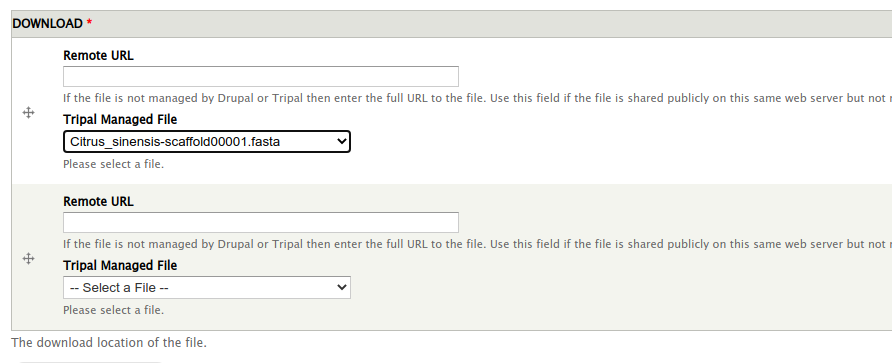

Otherwise you can provide a remote URL for the file.

.. note::

    A file can have more than one download location, and you can combine both local and remote files.

.. note::

    Providing a file source or "contact" is optional, but is recommended. Every file with a license should indicate, via the "file source" field, who retains the license rights (if applicable).

After creation, the file page appears:

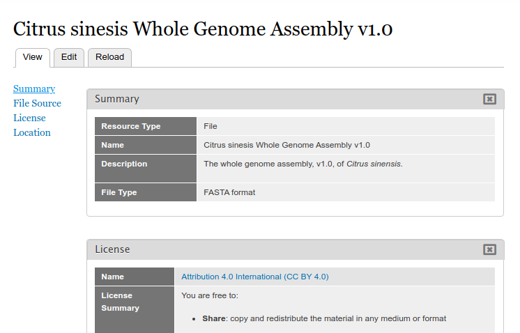

Adding File Metadata
--------------------
Manually Adding Metadata
````````````````````````
You can add additional metadata to a file by adding new fields to the file content type. To do this, navigate to **Admin** >  **Structure** > **Tripal Content Types** and click the **manage fields** link in the **File** row. Scroll to the section titled **Add new field**.  The field Type and field widget should be **Chado Property**:

.. image:: ./add_property1.png

Name the property according as needed.  Suppose we wanted to add a **genus** and **species** property to each file as metadata.  We would add each one by first providing the name and clicking the **Save** button at the bottom.  Next, Tripal provides a page for more details.   Here the most important setting is the **Controlled Vocabulary Term**.  To ensure data meets FAIR standards all metadata must be associated with a controlled vocabulary term. Here, we can search for and select the term **genus** and click the **save settings** button.  We can repeat this step for the **species**. Once completed we should see two new fields associated with our File content type.

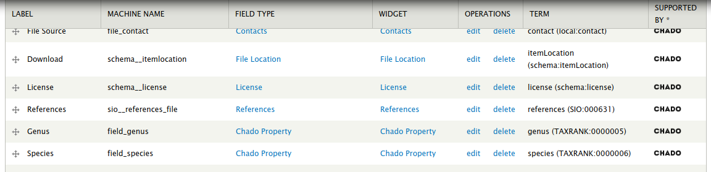

We now have two new fields that can be used for metadata but we must make those visible on the page when data is present for them. You can follow the instructions for `Configuring Page Layout <https://tripal.readthedocs.io/en/latest/user_guide/content_types/configuring_page_display.html>`_ in the Tripal User's Guide to place these new metadata fields where you want on the page.  For this example, we will pace them in the **Summary** section of the page layout.

If we return to the any File page and edit it then we will now have a new metadata field for storing the genus.

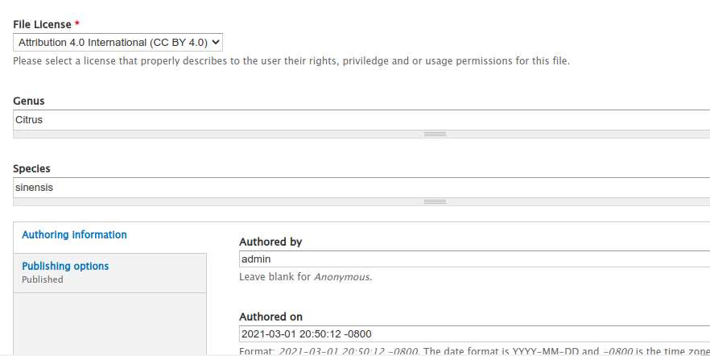

Now when we view the page we can see the genus and species metdata for the file

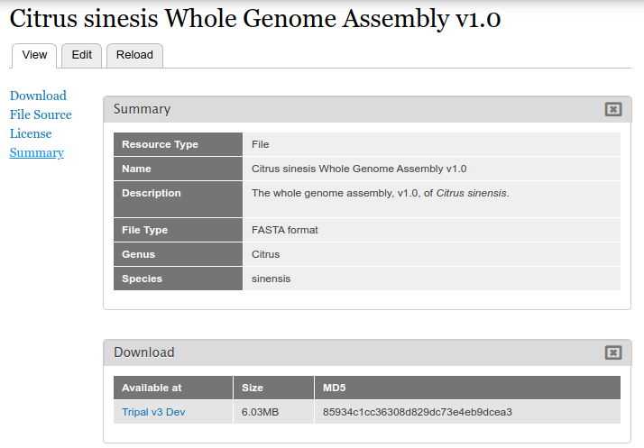

Adding Metadata in Bulk
```````````````````````
Because there is no common file format for providing metadata the best way to add metadata in bulk is to use the Tripal Bulk Loader, a module that comes built-in to Tripal v3.  You can find a tutorial for learning to use the bulk loader at the `Bulk Loader <https://tripal.readthedocs.io/en/latest/user_guide/bulk_loader.html>`_ tutorial of the Tripal User's Guide.

Use of the bulk loader requires a good understanding of Chado, its database tables, their constraints and relationships.  If you are comfortable with Chado, you can use the Tripal bulk loader to add metadata about files using a tab-delimited file.  To do so you need to

1.  Identify controlled vocabulary (CV) terms for each metadata value.
2.  Ensure that those CV terms are already in Tripal and if not, you need to add them.
3.  Create a tab-delimited file that contains the file name used in Tripal and as many columns of metadata values as desired.
4.  Create a bulk loader template to recognize the file and import it.

The following provides the schema for the **file** and **fileprop** tables that were added to Chado by the Tripal File module.  The **fileprop** table is where you will add metadata values.

File Module Chado Tables
~~~~~~~~~~~~~~~~~~~~~~~~
The file Table
++++++++++++++
The *file* table houses the base file record.  The *name* field must be a unique value for each file and thus can be selected on for finding files.

+-------------+------------+------+---------------+---------------------------+
| Column      | Type	   | Null | Default Value | Constraint                |
+=============+============+======+===============+===========================+
| file_id     | integer    | No   | (auto)        | Primary Key               |
+-------------+------------+------+---------------+---------------------------+
| name        | text       | No   |               | Unique                    |
+-------------+------------+------+---------------+---------------------------+
| type_id     | integer    | No   |               | Foreign Key to **cvterm** |
+-------------+------------+------+---------------+---------------------------+
| description | text       | Yes  |               |                           |
+-------------+------------+------+---------------+---------------------------+


The fileprop Table
++++++++++++++++++
The *fileprop* table holds the properties or metadata about files. The CV term is specified using the *type_id* column and the rank is incremented if multiple values of the same type are stored.

+-------------+------------+------+---------------+---------------------------+
| Column      | Type	   | Null | Default Value | Constraint                |
+=============+============+======+===============+===========================+
| fileprop_id | integer    | No   | (auto)        | Primary Key               |
+-------------+------------+------+---------------+---------------------------+
| file_id     | integer    | No   |               | Foreign Key to **file**   |
+-------------+------------+------+---------------+---------------------------+
| type_id     | integer    | No   |               | Foreign Key to **cvterm** |
+-------------+------------+------+---------------+---------------------------+
| value       | text       | Yes  |               |                           |
+-------------+------------+------+---------------+---------------------------+
| rank        | integer    | No   | 0             |                           |
+-------------+------------+------+---------------+---------------------------+


The fileloc Table
+++++++++++++++++
The *fileloc* table indicates where files can be downloaded. The *uri* column must contain the URI of the file. Even local files have a URI. For example a Drupal URI usually has a  *public://* URI prefix. For example: ```public://tripal/users/1/Citrus_sinensis-scaffold0.fasta```. When a file has more than one location to download the can be ordered by setting the *rank* column.  The Tripal file module automatically fills in the *size* and *md5checksum* values for local files. If you are adding file locations via the bulk loader you must provide these or the will not be available.

+-------------+------------+------+---------------+---------------------------+
| Column      | Type	   | Null | Default Value | Constraint                |
+=============+============+======+===============+===========================+
| fileloc_id  | integer    | No   | (auto)        | Primary Key               |
+-------------+------------+------+---------------+---------------------------+
| file_id     | integer    | No   |               | Foreign Key to **file**   |
+-------------+------------+------+---------------+---------------------------+
| uri         | text       | No   |               |                           |
+-------------+------------+------+---------------+---------------------------+
| rank        | text       | No   | 0             |                           |
+-------------+------------+------+---------------+---------------------------+
| md5checksum | integer    | Yes  |               |                           |
+-------------+------------+------+---------------+---------------------------+
| size        | char(1024) | Yes  |               |                           |
+-------------+------------+------+---------------+---------------------------+


Associating a File with Other Content
-------------------------------------
Now that we have a file page we can associate that file with any other Tripal-based content.  As stated earlier, we will follow the User's Guide example where an Analysis page for the *Citrus sinensis* whole genome page was already created.  We will associate the whole genome FASTA file to the analysis page.

Before we can associate a file with an analysis, we must first add a new field for the file to the Analysis content type.  Navigate to **Admin** >  **Structure** > **Tripal Content Types** and click the **manage fields** link in the **Analysis** row.

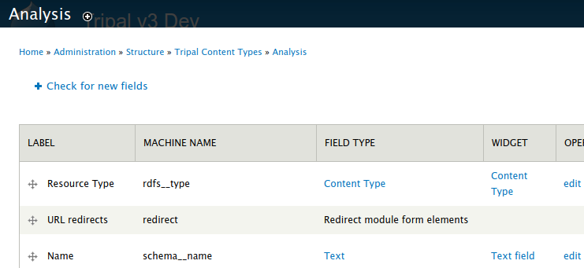

Click the **Check for new fields** link.  Unlike adding fields for Metadata, the Tripal File module can automatically add fields for files. You should see the following message after clicking the link:

..

  Added field: sio__file

Once again we must tell Drupal where on the page to display this new field.  Follow the instructions on the  `Configuring Page Layout <https://tripal.readthedocs.io/en/latest/user_guide/content_types/configuring_page_display.html>`_ of the Tripal User's guide to learn how to do this.  For this example, we will use the Tripal Default Display option to automatically place the file field.

.. note::
    You may be asking, why do I have to add the field then set the display?  Why can't the module do it automatically?  The reason is that Tripal supports full customization of every page by the site admin and the Tripal File module does not want to make any assumptions about when and where any fields will be displayed. So the site admin must add them manually.

Next, find the Analysis page via **Admin** > **Find Tripal Content**.  If you followed the Tripal User's Guide it will be named "Whole Genome Assembly and Annotation of Citrus Sinensis (JGI)". But if do not have this page, any practice Analysis page will do.  Edit the page and scroll to the new section titled **File**.  You should see a drop down containing a list of available files.

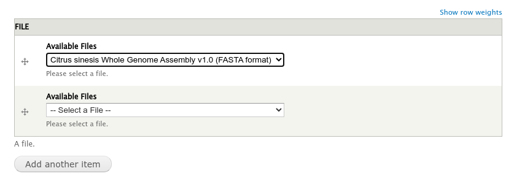

Select the file and click the **Save** button at the bottom. We now have a **File** item for the page.

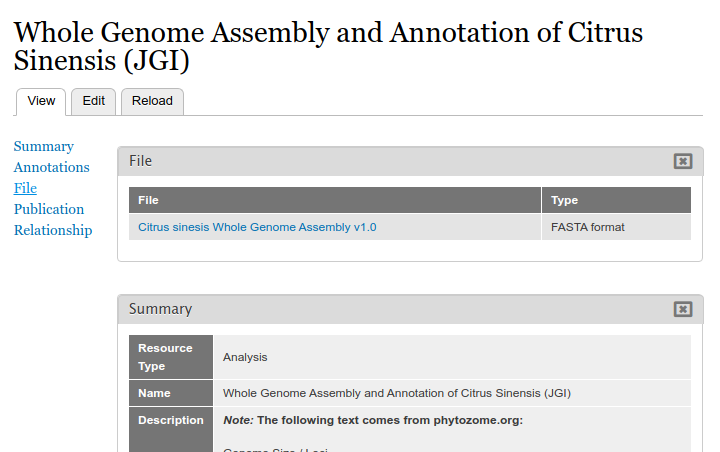

Clicking the file link will take the user to the full file page where they can download the file, view the license information, and view metadata about the file.

Accessing Files via Web-Services
--------------------------------
All information about files can be obtained via the built-in Tripal Content web services.  You can learn about how to access Tripal web services via the `Web Services <https://tripal.readthedocs.io/en/latest/user_guide/web_services.html>`_ page of the Tripal User's Guide.  When web services are enabled you can:

1. Retrieve the list of files associated with any content.
2. Retrieve all information about a file, including its name, description, license, source, download locations and metadata.

The following screen shot provides an example of the JSON returned for the Analysis content to which we associated the genome file:

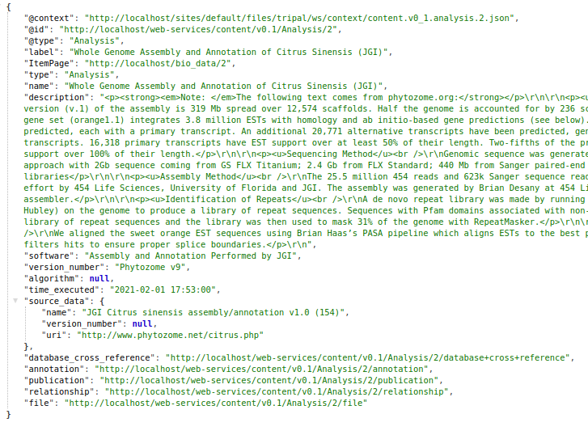

Note, the file key at the bottom of the JSON output?  Following this URL provides information about the file. If more than one file is associated with the content then an array of files is provided.

Below is a screenshot of the JSON result for the file:

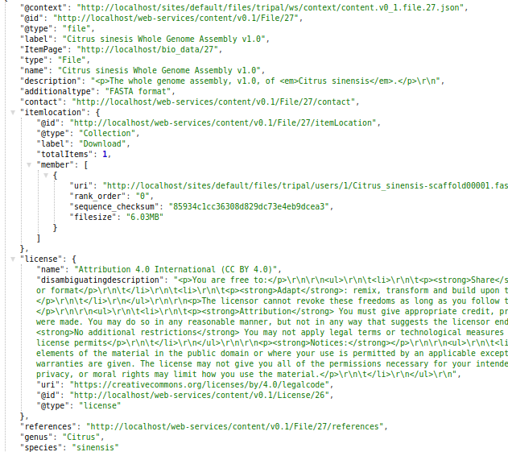
